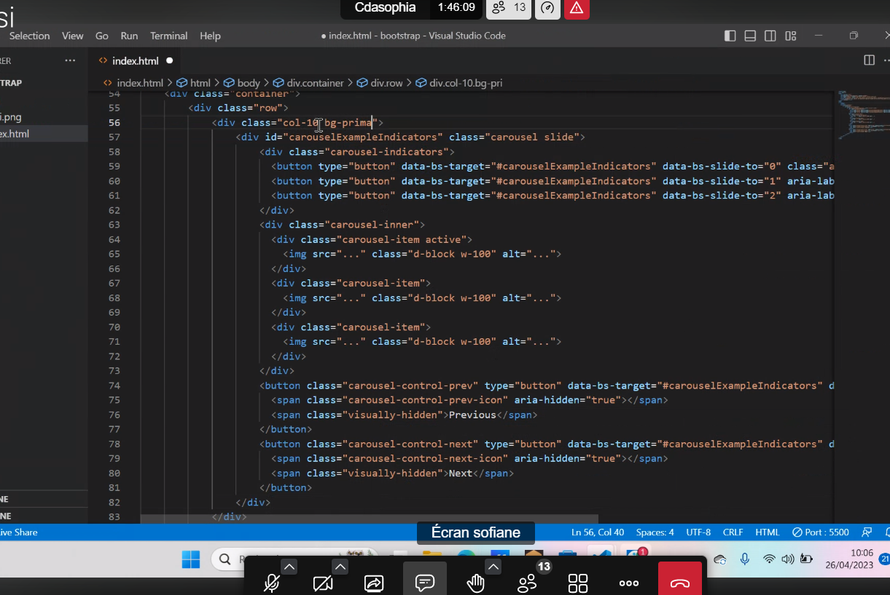
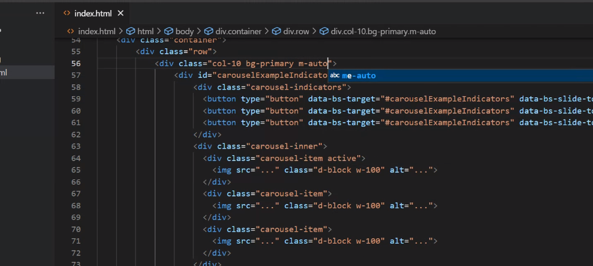

# Bootstrap

[Bootstrap](https://getbootstrap.com/docs/5.3/getting-started/introduction/)

Il divise l'écran en 12 colonnes.
Il y a plusieurs breakpoint, si l'on ne précise rien, il se base sur du mobile = **mobile first**.
L'on peut ainsi ne pas utiliser de media quiery.

Un container de base prend 100% soit 12 colonnes.

La manière de faire du Bootstrap sera toujours avec container, row, col.
De manière générale, ça utilise le grid.

Depuis sa version 5, nous permet d'avoir accès à des thèmes et des icônes notamment via npm ou figma.

Dans cet exercie, nous avons travaillé une navbar, un carousel, ainsi que des card.
Nous avons appliqué du style à ces card, afin qu'elles soient responsive.

Ci-dessous des captures d'écran de l'adaptation du carousel:

